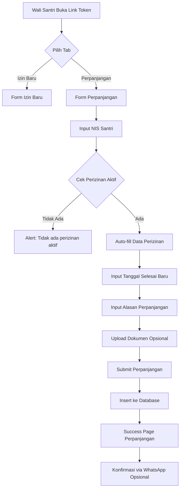

# 🔄 INTEGRASI PERPANJANGAN IZIN KE FORM UTAMA
## Portal Keasramaan - HSI Boarding School

---

## 📋 RINGKASAN PERUBAHAN

Fitur perpanjangan izin telah **diintegrasikan** ke dalam halaman form utama perizinan kepulangan. Sekarang wali santri hanya perlu **1 link** untuk mengajukan izin baru ATAU perpanjangan izin.

### ✨ Perubahan Utama:

1. ✅ **Tab Navigation** - Pilihan antara "Izin Baru" dan "Perpanjangan Izin"
2. ✅ **Input NIS** untuk perpanjangan (bukan dropdown nama santri)
3. ✅ **Auto-fill data** perizinan aktif berdasarkan NIS
4. ✅ **Upload dokumen** pendukung (surat dokter, surat keterangan, dll)
5. ✅ **Success page** yang berbeda untuk izin baru vs perpanjangan
6. ✅ **WhatsApp integration** untuk konfirmasi ke Kepala Asrama

---

## 🔗 URL YANG DIGUNAKAN

### Sebelum (2 Link Terpisah):
```
http://localhost:3000/perizinan/kepulangan/form/[token]           ← Izin Baru
http://localhost:3000/perizinan/kepulangan/perpanjangan/[token]  ← Perpanjangan
```

### Sesudah (1 Link Saja):
```
http://localhost:3000/perizinan/kepulangan/form/[token]  ← Izin Baru + Perpanjangan
```

**Catatan**: Link perpanjangan lama masih berfungsi, tapi tidak perlu digunakan lagi.

---

## 🎨 TAMPILAN BARU

### 1. Tab Navigation
```
┌─────────────────────────────────────────────┐
│  [📄 Izin Baru]  [🔄 Perpanjangan Izin]    │
└─────────────────────────────────────────────┘
```

- **Tab Izin Baru**: Warna biru (form seperti biasa)
- **Tab Perpanjangan**: Warna orange (form perpanjangan)

### 2. Form Perpanjangan Izin

**Input NIS:**
```
┌─────────────────────────────────────────────┐
│ NIS Santri *                                │
│ ┌─────────────────────────────────────────┐ │
│ │ Masukkan NIS santri yang sedang izin   │ │
│ └─────────────────────────────────────────┘ │
└─────────────────────────────────────────────┘
```

**Auto-fill Data Perizinan Aktif:**
```
┌─────────────────────────────────────────────┐
│ Data Perizinan Aktif:                       │
│ ┌─────────────────────────────────────────┐ │
│ │ Nama: Ahmad Fauzi                       │ │
│ │ Kelas: X IPA 1                          │ │
│ │ Asrama: Al-Fatih                        │ │
│ │ Cabang: Putra                           │ │
│ │ Tanggal Mulai: 15 Nov 2025              │ │
│ │ Tanggal Selesai Awal: 20 Nov 2025       │ │
│ │ Durasi Awal: 5 hari                     │ │
│ └─────────────────────────────────────────┘ │
└─────────────────────────────────────────────┘
```

**Input Tanggal Selesai Baru:**
```
┌─────────────────────────────────────────────┐
│ Tanggal Selesai Baru *                      │
│ ┌─────────────────────────────────────────┐ │
│ │ [📅 25/11/2025]                         │ │
│ └─────────────────────────────────────────┘ │
│ Harus lebih lama dari tanggal selesai awal  │
└─────────────────────────────────────────────┘
```

**Alasan Perpanjangan:**
```
┌─────────────────────────────────────────────┐
│ Alasan Perpanjangan *                       │
│ ┌─────────────────────────────────────────┐ │
│ │ Jelaskan alasan perpanjangan izin       │ │
│ │ (contoh: Sakit, keperluan keluarga      │ │
│ │ mendadak, dll)                           │ │
│ └─────────────────────────────────────────┘ │
└─────────────────────────────────────────────┘
```

**Upload Dokumen Pendukung:**
```
┌─────────────────────────────────────────────┐
│ Tipe Dokumen Pendukung                      │
│ ┌─────────────────────────────────────────┐ │
│ │ [Surat Dokter ▼]                        │ │
│ └─────────────────────────────────────────┘ │
│                                             │
│ Upload Bukti Dokumen (Opsional)            │
│ ┌─────────────────────────────────────────┐ │
│ │        📤                                │ │
│ │  Klik untuk upload atau drag & drop     │ │
│ │  JPG, PNG, atau PDF (Max. 5MB)          │ │
│ │  [Pilih File]                            │ │
│ └─────────────────────────────────────────┘ │
└─────────────────────────────────────────────┘
```

---

## 🔧 PERUBAHAN TEKNIS

### File yang Dimodifikasi:
```
app/perizinan/kepulangan/form/[token]/page.tsx
```

### State Baru yang Ditambahkan:
```typescript
// Tab state
const [activeTab, setActiveTab] = useState<'new' | 'extend'>('new');

// State untuk perpanjangan izin
const [extendFormData, setExtendFormData] = useState({
  nis: '',
  nama_siswa: '',
  kelas: '',
  asrama: '',
  cabang: '',
  perizinan_id: '',
  tanggal_mulai_awal: '',
  tanggal_selesai_awal: '',
  tanggal_selesai_baru: '',
  alasan_perpanjangan: '',
  durasi_awal: 0,
});

const [selectedFile, setSelectedFile] = useState<File | null>(null);
const [previewUrl, setPreviewUrl] = useState<string | null>(null);
const [tipeDokumen, setTipeDokumen] = useState('surat_dokter');
const [existingPerizinan, setExistingPerizinan] = useState<any>(null);
```

### Fungsi Baru:
1. **`handleExtendNISBlur()`** - Cari perizinan aktif berdasarkan NIS
2. **`handleFileSelect()`** - Handle upload file dokumen
3. **`handleExtendSubmit()`** - Submit perpanjangan izin

### Database Schema:
Perpanjangan disimpan di tabel yang sama `perizinan_kepulangan_keasramaan` dengan:
```sql
is_perpanjangan: true
perizinan_induk_id: UUID (reference ke perizinan asal)
alasan_perpanjangan: TEXT
jumlah_perpanjangan_hari: INTEGER
perpanjangan_ke: INTEGER (1, 2, 3, dst)
dokumen_pendukung_url: TEXT
dokumen_pendukung_uploaded_at: TIMESTAMP
dokumen_pendukung_tipe: TEXT
```

---

## 📊 ALUR PERPANJANGAN IZIN



---

## ✅ VALIDASI

### Validasi Input NIS:
1. ✅ NIS harus ada di database
2. ✅ Harus ada perizinan dengan status `approved_kepsek`
3. ✅ Perizinan belum selesai atau max 3 hari setelah selesai
4. ✅ Tidak boleh perpanjangan dari perpanjangan (hanya dari perizinan induk)

### Validasi Tanggal:
1. ✅ Tanggal selesai baru harus lebih lama dari tanggal selesai awal
2. ✅ Tanggal selesai baru tidak boleh di masa lalu

### Validasi File:
1. ✅ Format: JPG, PNG, PDF
2. ✅ Ukuran maksimal: 5MB
3. ✅ Upload bersifat opsional

---

## 🎯 CARA PENGGUNAAN

### Untuk Wali Santri:

1. **Buka link token** yang diberikan oleh sekolah
2. **Pilih tab** sesuai kebutuhan:
   - **Izin Baru**: Untuk mengajukan izin kepulangan baru
   - **Perpanjangan Izin**: Untuk memperpanjang izin yang sudah ada
3. **Isi form** sesuai tab yang dipilih
4. **Submit** dan tunggu persetujuan
5. **Konfirmasi via WhatsApp** (opsional) untuk mempercepat proses

### Untuk Admin/Kepala Asrama:

1. **Generate 1 token** saja per cabang
2. **Bagikan link** ke wali santri
3. **Wali santri bisa gunakan** untuk izin baru ATAU perpanjangan
4. **Tidak perlu** generate token terpisah untuk perpanjangan

---

## 📝 CATATAN PENTING

1. ✅ **Backward Compatible**: Link perpanjangan lama (`/perpanjangan/[token]`) masih berfungsi
2. ✅ **Single Source of Truth**: Semua data perpanjangan tersimpan di tabel yang sama
3. ✅ **Approval Flow**: Perpanjangan tetap harus disetujui Kepala Asrama → Kepala Sekolah
4. ✅ **Storage Bucket**: Pastikan bucket `perizinan` sudah dibuat di Supabase Storage
5. ✅ **RLS Policy**: Pastikan policy untuk insert/select sudah di-set dengan benar

---

## 🚀 TESTING

### Test Case 1: Izin Baru
1. Buka link token
2. Pilih tab "Izin Baru"
3. Isi form seperti biasa
4. Submit
5. ✅ Harus berhasil dan tampil success page

### Test Case 2: Perpanjangan Izin
1. Buka link token
2. Pilih tab "Perpanjangan Izin"
3. Input NIS santri yang sedang izin
4. ✅ Data perizinan harus auto-fill
5. Isi tanggal selesai baru
6. Isi alasan perpanjangan
7. Upload dokumen (opsional)
8. Submit
9. ✅ Harus berhasil dan tampil success page perpanjangan

### Test Case 3: Validasi NIS Tidak Ada
1. Pilih tab "Perpanjangan Izin"
2. Input NIS yang tidak ada perizinan aktif
3. ✅ Harus muncul alert "Tidak ada perizinan aktif"

---

**Dibuat oleh**: Augment AI Assistant  
**Tanggal**: 20 November 2025  
**Versi**: 1.0

